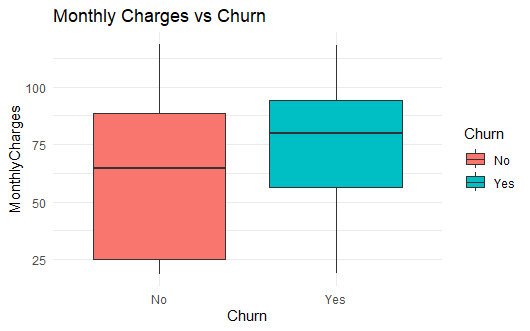
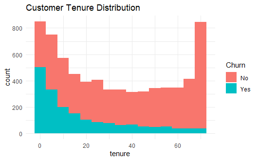

# 📊 Customer Churn Analysis Using R


---

# 📌 Project Overview

This project analyzes customer churn behavior using the IBM Telco Customer Churn dataset.

The goal is to identify key factors that influence customer churn and provide actionable insights for improving customer retention.

---

# 🗂️ Dataset

📌 **Dataset:** IBM Telco Customer Churn Dataset  
🔗 **Source:** IBM Sample Data (Telco Customer Churn)

---

# 🛠️ Tools & Technologies

- 📘 R Programming
- 💻 RStudio
- 📊 ggplot2
- 🧹 dplyr
- 📂 readr
- 🔄 tidyverse

---

# 📈 Project Workflow

## 1️⃣ Data Import
- Loaded dataset into RStudio

## 2️⃣ Data Cleaning
- Converted `TotalCharges` to numeric
- Handled missing values
- Checked data consistency

## 3️⃣ Exploratory Data Analysis (EDA)
Analyzed:
- Customer churn rate
- Contract types
- Monthly charges
- Customer tenure
- Internet services

## 4️⃣ Data Visualization
Created visualizations using ggplot2:
- Churn by contract type
- Monthly charges vs churn
- Customer tenure distribution
- Churn by internet service

---

# 📊 Visualizations

---

## 📌 Churn by Contract Type


---

## 📌 Monthly Charges vs Churn



---

## 📌 Customer Tenure Distribution



---

## 📌 Churn by Internet Service


---

# 🔍 Key Findings

## 📉 Month-to-Month Contracts Have Highest Churn
Customers without long-term contracts are more likely to leave.

## 💰 Higher Monthly Charges Increase Churn
Customers paying higher fees show higher churn probability.

## 📈 Longer Tenure Reduces Churn
Long-term customers are more loyal and stable.

## 🌐 Fiber Optic Customers Show Higher Churn
Possible issues with pricing or service satisfaction.

---

# 💡 Business Recommendations

- ✅ Promote long-term contracts
- ✅ Improve onboarding experience
- ✅ Introduce loyalty rewards
- ✅ Optimize pricing strategies for high-paying customers
- ✅ Investigate fiber optic service satisfaction

---

# 📁 Project Structure

```text
customer-churn-analysis/
│
├── data/
│   └── WA_Fn-UseC_-Telco-Customer-Churn.csv
│
├── scripts/
│   └── churn_analysis.R
│
├── visuals/
│   ├── churn_by_contract_type.png
│   ├── monthly_charges_vs_churn.png
│   ├── customer_tenure_distribution.png
│   └── churn_by_internet_service.png
│
└── README.md
