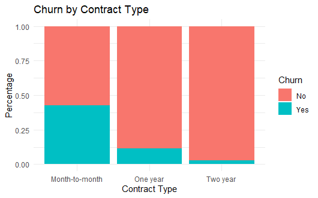
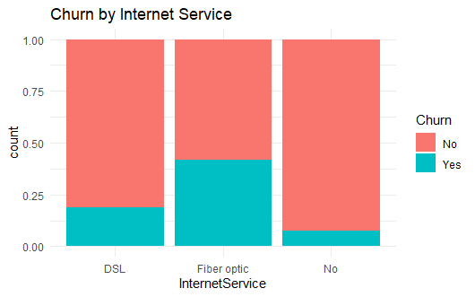

# Customer Churn Analysis Using R

## Project Overview

This project analyzes customer churn behavior using the IBM Telco Customer Churn dataset.

The goal of this analysis is to identify patterns that contribute to customer churn and provide business recommendations to improve customer retention.

---

## Dataset

Dataset Source:
IBM Telco Customer Churn Dataset

Source:
Telco Customer Churn 

Telco Customer Churn
Focused customer retention programs


---

## Tools & Technologies

- R
- RStudio
- tidyverse
- ggplot2
- dplyr
- readr

---

## Project Workflow

### 1. Data Import
- Imported customer churn dataset into RStudio

### 2. Data Cleaning
- Converted TotalCharges to numeric
- Removed missing values

### 3. Exploratory Data Analysis (EDA)
Performed analysis on:
- Customer churn rate
- Contract type
- Monthly charges
- Customer tenure
- Internet services

### 4. Data Visualization
Created visualizations using ggplot2:
- Churn by contract type
- Monthly charges vs churn
- Customer tenure distribution
- Churn by internet service

---

## Key Findings

### Customers with month-to-month contracts had the highest churn rate.
Customers without long-term commitments were more likely to leave the company.

### Higher monthly charges were associated with increased churn.
Customers paying higher fees tended to cancel services more frequently.

### Customers with longer tenure showed lower churn rates.
Long-term customers were more loyal and less likely to leave.

### Fiber optic customers experienced higher churn rates.
This may indicate pricing or service satisfaction issues.

---

## Business Recommendations

- Encourage customers to switch to long-term contracts
- Improve onboarding for new customers
- Offer loyalty rewards for long-term users
- Create pricing strategies for high-paying customers
- Investigate customer satisfaction among fiber optic users

---

## Visualizations

### Churn by Contract Type


### Monthly Charges vs Churn


### Customer Tenure Distribution


### Churn by Internet Service

---

## Project Structure

```text
customer-churn-analysis/
│
├── data/
│   └── WA_Fn-UseC_-Telco-Customer-Churn.csv
│
├── scripts/
│   └── churn_analysis.R
│
├── images/
│   ├── Churn by Contract Type.png
|   ├── Churn by Internet Service.png
    ├── Customer Tenure Distribution.png
    └── Monthly Charges vs Churn.png 
|   
└── README.md
```

---

## Author

**Ahmed Basheer**  
Aspiring Data Analyst  

SQL | Google Sheets | Tableau | Rstudio
